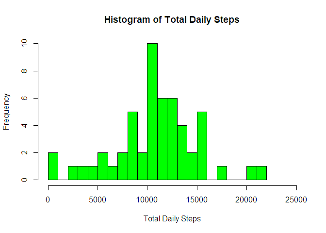
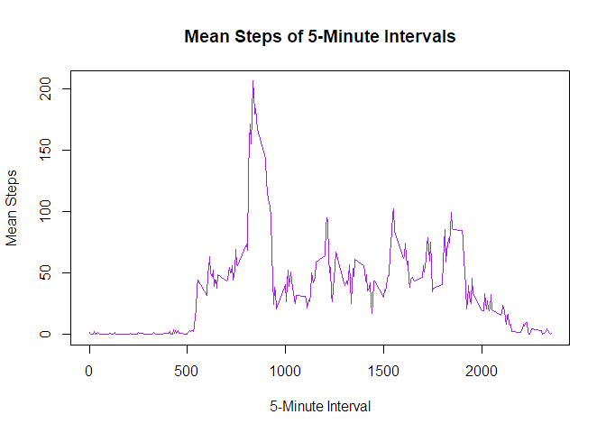
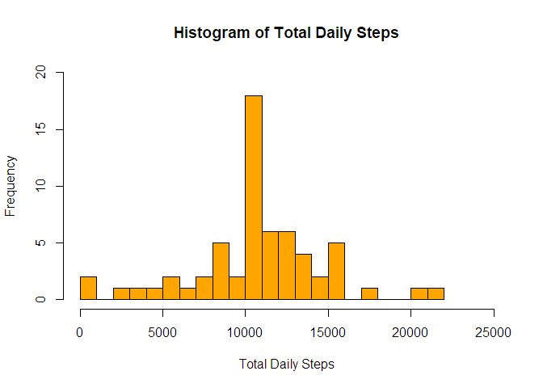
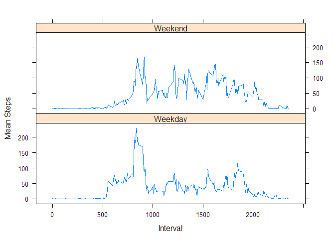

# Reproducible Research: Peer Assessment 1


## Loading and preprocessing the data


```r
activity <- read.csv("activity.csv")
```

## What is mean total number of steps taken per day?

Compute the total number of steps per day by grouping by the date factor and summing the steps.

```r
agg <- aggregate(activity$steps, by=list(Date = activity$date), FUN=sum)
agg
```

```
##          Date     x
## 1  2012-10-01    NA
## 2  2012-10-02   126
## 3  2012-10-03 11352
## 4  2012-10-04 12116
## 5  2012-10-05 13294
## 6  2012-10-06 15420
## 7  2012-10-07 11015
## 8  2012-10-08    NA
## 9  2012-10-09 12811
## 10 2012-10-10  9900
## 11 2012-10-11 10304
## 12 2012-10-12 17382
## 13 2012-10-13 12426
## 14 2012-10-14 15098
## 15 2012-10-15 10139
## 16 2012-10-16 15084
## 17 2012-10-17 13452
## 18 2012-10-18 10056
## 19 2012-10-19 11829
## 20 2012-10-20 10395
## 21 2012-10-21  8821
## 22 2012-10-22 13460
## 23 2012-10-23  8918
## 24 2012-10-24  8355
## 25 2012-10-25  2492
## 26 2012-10-26  6778
## 27 2012-10-27 10119
## 28 2012-10-28 11458
## 29 2012-10-29  5018
## 30 2012-10-30  9819
## 31 2012-10-31 15414
## 32 2012-11-01    NA
## 33 2012-11-02 10600
## 34 2012-11-03 10571
## 35 2012-11-04    NA
## 36 2012-11-05 10439
## 37 2012-11-06  8334
## 38 2012-11-07 12883
## 39 2012-11-08  3219
## 40 2012-11-09    NA
## 41 2012-11-10    NA
## 42 2012-11-11 12608
## 43 2012-11-12 10765
## 44 2012-11-13  7336
## 45 2012-11-14    NA
## 46 2012-11-15    41
## 47 2012-11-16  5441
## 48 2012-11-17 14339
## 49 2012-11-18 15110
## 50 2012-11-19  8841
## 51 2012-11-20  4472
## 52 2012-11-21 12787
## 53 2012-11-22 20427
## 54 2012-11-23 21194
## 55 2012-11-24 14478
## 56 2012-11-25 11834
## 57 2012-11-26 11162
## 58 2012-11-27 13646
## 59 2012-11-28 10183
## 60 2012-11-29  7047
## 61 2012-11-30    NA
```

Plot histogram with the above data.

```r
hist(agg$x, breaks = 30, xlim = c(0, 25000), col = "green", xlab = "Total Daily Steps", main = "Histogram of Total Daily Steps")
```

<!-- -->

As shown below, the mean total steps per day is `10,770` and the median is `10,760`.

```r
summary(agg$x)
```

```
##    Min. 1st Qu.  Median    Mean 3rd Qu.    Max.    NA's 
##      41    8841   10760   10770   13290   21190       8
```

## What is the average daily activity pattern?

Assemble the data set to be graphed by grouping by intervals and averaging the number of steps.

```r
intervals <- aggregate(activity$steps, by = list(interval = activity$interval), FUN=mean, na.rm=TRUE)
```

Plot above data in a line graph.

```r
plot(intervals$interval, intervals$x, type= "l", 
     xlab = "5-Minute Interval", ylab = "Mean Steps", main = "Mean Steps of 5-Minute Intervals", col = "purple")
```

<!-- -->

Interval `835` has the most steps on average at approx. `206.2` steps.

```r
subset(intervals, intervals$x == max(intervals$x))
```

```
##     interval        x
## 104      835 206.1698
```

## Imputing missing values

There are `2,304` rows with `NA` steps recorded.

```r
sum(is.na(activity$steps))
```

```
## [1] 2304
```

Replace `NA` values with mean of that interval. Create a clone of `activity` called `activity_imp` to do this.

```r
tempmerge <- merge(activity, intervals, by = "interval")
lvec = is.na(tempmerge$steps) == TRUE
tempmerge$steps[lvec] = tempmerge$x[lvec]
sum(is.na(tempmerge$steps)) # check that there are no more NA values
```

```
## [1] 0
```

```r
activity_imp = tempmerge[, c(1:3)]
```

Repeat process of histogram with imputed data. While the overall shape of the histogram is similar to that of the original aggregated data set, the frequency of the `10,000 to 11,000` steps bin is notably higher.

```r
agg_imp <- aggregate(activity_imp$steps, by=list(Date = activity_imp$date), FUN=sum)
hist(agg_imp$x, breaks = 30, xlim = c(0, 25000), ylim = c(0,20), col = "orange", xlab = "Total Daily Steps", main = "Histogram of Total Daily Steps")
```

<!-- -->

The mean is unchanged and the median is almost unchanged. However, there has been a slight shift from the number of values in the 3rd quartile to the 1st quartile.

```r
summary(agg$x)
```

```
##    Min. 1st Qu.  Median    Mean 3rd Qu.    Max.    NA's 
##      41    8841   10760   10770   13290   21190       8
```

```r
summary(agg_imp$x)
```

```
##    Min. 1st Qu.  Median    Mean 3rd Qu.    Max. 
##      41    9819   10770   10770   12810   21190
```

## Are there differences in activity patterns between weekdays and weekends?

Create a new `daytype` column within `activity_imp`. Then aggregate by interval and plot.

```r
activity_imp$dayname <- weekdays(as.Date(activity_imp$date))
activity_imp$daytype <- ifelse(activity_imp$dayname %in% c("Saturday", "Sunday"), "Weekend", "Weekday")
intervals_daytype <- aggregate(activity_imp$steps, by = list(interval = activity_imp$interval, daytype = activity_imp$daytype), FUN=mean, na.rm=TRUE)
```

Plot the two panels. From the results, it seems that while people are less active in the morning on weekends than weekdays, they are more active in the afternoon on weekends than weekdays.

```r
library(lattice)
```

```
## Warning: package 'lattice' was built under R version 3.2.5
```

```r
xyplot(x ~ interval | daytype, intervals_daytype, type = "l", layout = c(1, 2), 
    xlab = "Interval", ylab = "Mean Steps")
```

<!-- -->
